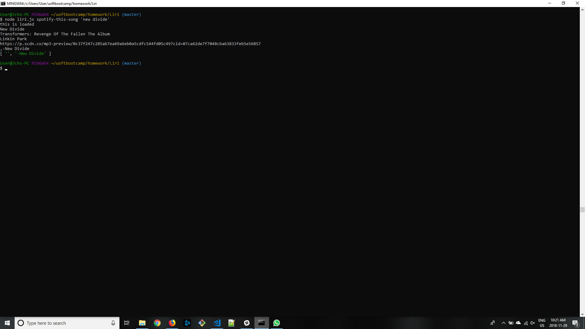
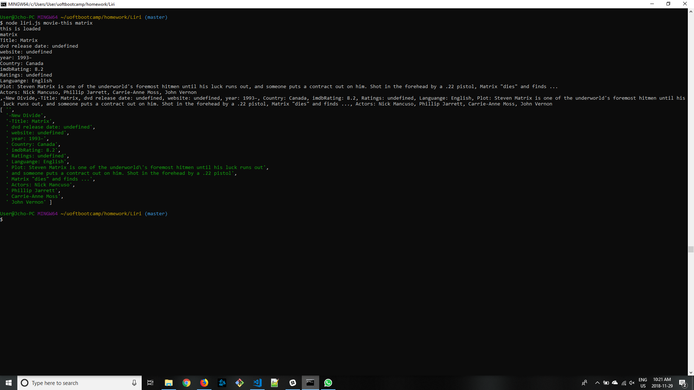
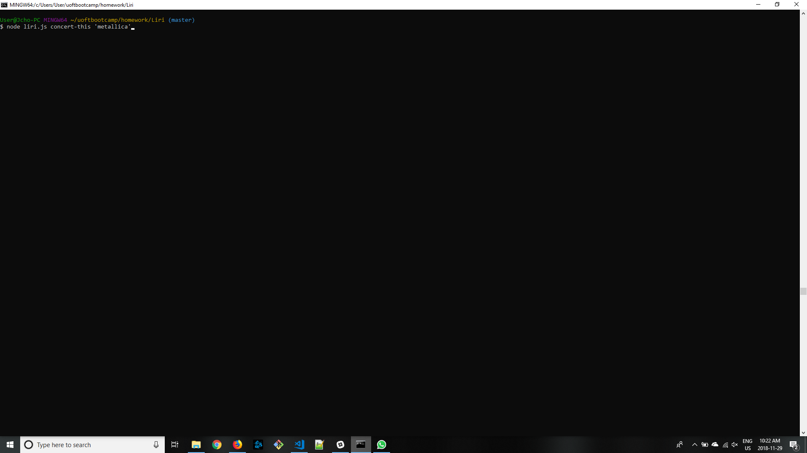
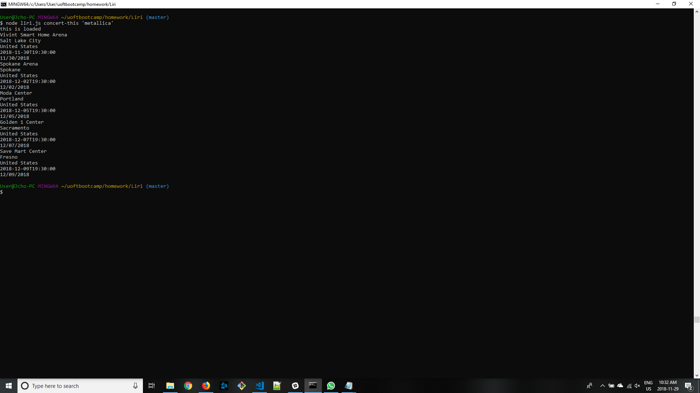
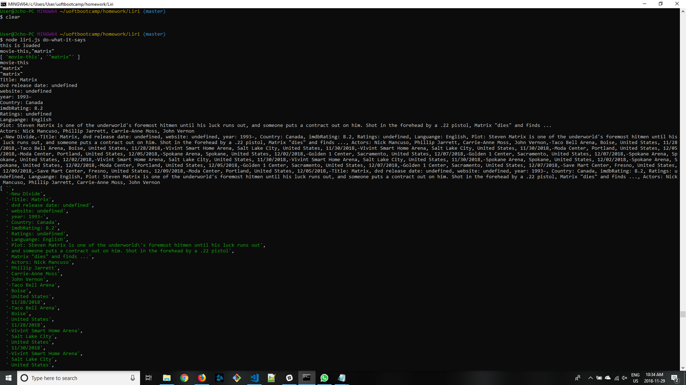

LIRI is a Language Interpretation and Recognition Interface. LIRI will be a command line node app that takes in parameters and gives you back data. LIRI uses the following commands:

Liri current intakes the following commands :
    -spotify-this-song
    -movie-this
    -do-what-it-says
    -concert-this

NPM Dependencies:
    - axios
    - moment
    - node-spotify-api

Api used
    -spotify
    -omdb
    -Bands in town
How to run Liri-bot:
    to Run Liri api in put one of the four commands in to your third argument on the command line and add in an apprpriate value in to your fourth argument. e.g if you were to use movie-this as your third argument provide a movie in your fourth argument. Liri will then run and grab data from the api and console log the data to your terminal. A log file is kept and Liri will then display all the previous searches you have made. 

    spotify-this-song:
    running spotify-this-song will display the following information:
        - track name
        - album name
        - artist name
        - preview url from spotify. If none is available Liri will display null
    
    if no song name is provided Liri will default to The sing by Ace of base

    movie-this:
    running movie-this will display the following information:
        - Title of the movie
        - DVD release date
        - Movie website
        - Year the movie was released
        - the imdb rating
        - rotten tomatoes rating
        - language it was released in 
        - plot of the movie
        - actors starred in the movie

    if no movie name was provided, Liri  will default to the movie mr.nobody

    concert-this: 
    running concert-this will display the following information about the artist: 
        - venue name
        - the city the venue is in
        - the country 
        - date the concert is playing
    Liri will display the first five venues the artist is playing at. 

    do-what-it-says
    running do-what-it-says will run a function preprogrammed into Liri, who knows what it might do. This is the only function that does not require a fourth argument. 

